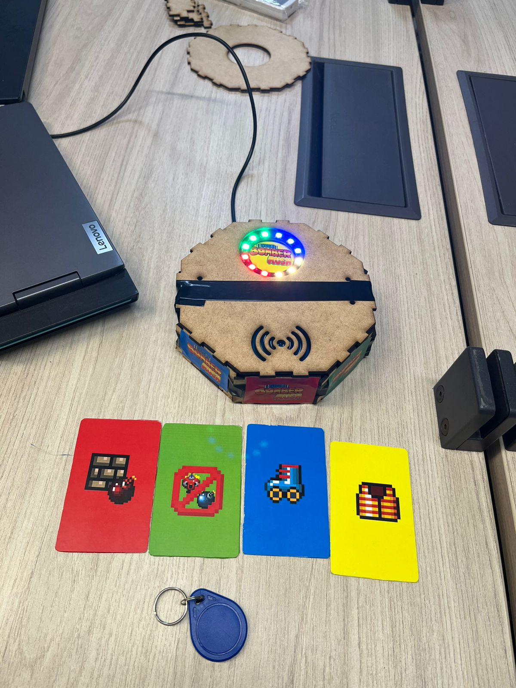
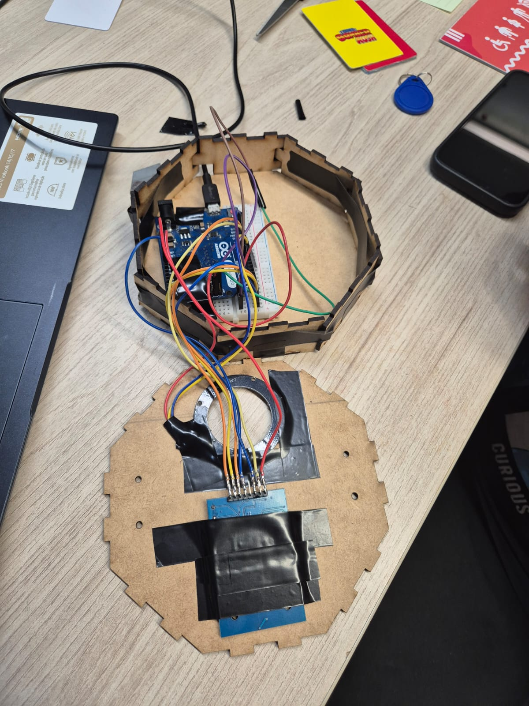
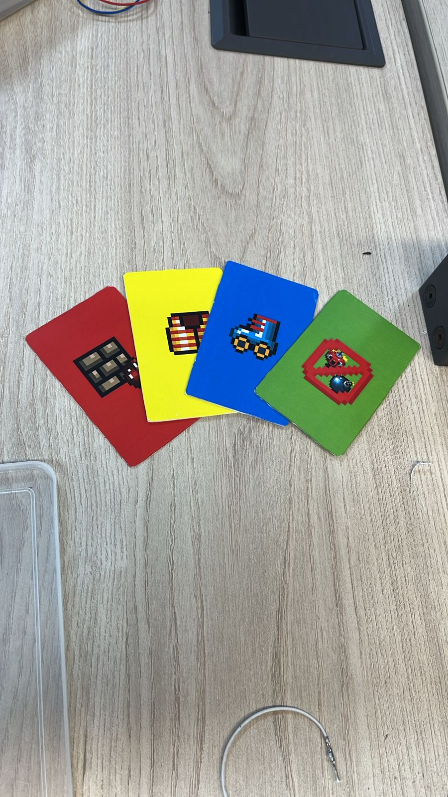

# BombStation

Este projeto contém um código para o **Arduino Leonardo** que utiliza um sensor **RFID RC522** para ler cartões e ativar eventos dentro do jogo **Bomber Rush**.

O Arduino funciona como um **teclado USB**: quando um cartão RFID é lido, ele envia uma tecla específica para o computador, e o jogo interpreta isso como um *power-up* ou evento especial.

O jogo **Bomber Rush** (em C) está disponível aqui:  
https://github.com/iampassos/bomber-rush

A ideia é permitir que cartões RFID atuem como **gatilhos físicos**, integrando elementos reais ao gameplay.

---

# Detalhamento

## 🎮 Console BombStation

A estrutura do console foi construída em **MDF**, com as peças cortadas em uma **cortadora a laser**.  
A proposta é servir como um **invólucro físico**, responsável por acomodar toda a parte interna do projeto, incluindo **fiação, soldas e componentes eletrônicos**.

  

---

## 🔧 Estrutura Interna

Foi utilizado um **Arduino Leonardo**, conectado a uma **fita LED endereçável em formato circular**.  
O Arduino também está conectado a um **sensor RFID**, responsável pela leitura dos cartões de habilidade.

Grande parte das conexões foi isolada com **fita isolante**, com o objetivo de **evitar curtos-circuitos** e **garantir maior firmeza** nas conexões elétricas.

  

---

## 🃏 Cartões de Habilidade

Os **cartões de habilidade** funcionam como gatilhos físicos que ativam eventos especiais dentro do jogo.  
Cada cartão pode ser utilizado **apenas uma vez por partida**, tornando seu uso uma decisão estratégica.

Existe uma **chave mestra** responsável por **resetar todas as habilidades**, permitindo que os cartões possam ser utilizados novamente.

A **fita LED circular** atua como um feedback visual: cada cor representa uma habilidade disponível.  
Quando uma habilidade é utilizada, a **cor correspondente é apagada**, indicando que aquele cartão não pode mais ser ativado.

  

### 🔴 Cartão Vermelho — Limpeza de Muros
Ao ser ativado, remove **todos os muros destrutíveis** presentes no mapa, alterando completamente a dinâmica da arena.

### 🟡 Cartão Amarelo — Invencibilidade
Torna **todos os jogadores invencíveis por 7 segundos**, permitindo jogadas agressivas sem risco de eliminação.

### 🔵 Cartão Azul — Velocidade
Aumenta a **velocidade de todos os personagens** do jogo por **7 segundos**, deixando a partida mais caótica e dinâmica.

### 🟢 Cartão Verde — Limpeza Total
Remove **todos os inimigos e bombas ativas** no mapa no momento da ativação, funcionando como um recurso de emergência.

---

## 🧩 Setup Completo em Funcionamento

Esta imagem apresenta o **setup completo do BombStation em funcionamento**, incluindo o console montado, os cartões de habilidade, o Arduino conectado e o jogo **Bomber Rush** em execução.

  

---

# Pinagem do Arduino Leonardo

## 📌 Conexões da Fita LED (WS2812 / Neopixel)
- **Data In** → Pino **7**
- **VCC (5V)** → 5V
- **GND** → GND

---

## 📌 Conexões do Leitor RFID RC522
- **3.3V** → 3.3V  
- **RST** → Pino **9**  
- **GND** → GND  
- **IRQ** → Não usado  
- **MISO** → MISO (ICSP)  
- **MOSI** → MOSI (ICSP)  
- **SCK** → SCK (ICSP)  
- **SDA / SS** → Pino **10**

---

# 📷 Imagem do Arduino Leonardo

